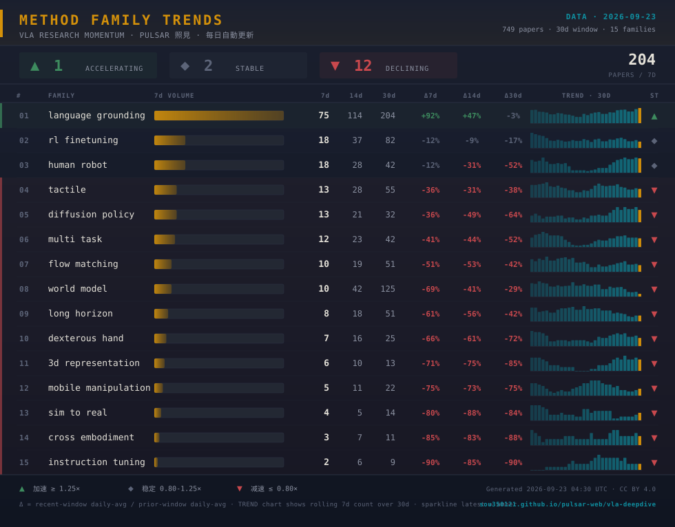

# Method Family Trends · VLA 方法族趋势

> 🖼️ **数据日期**: `2026-09-20` · **窗口**: 最近 `30` 天 · **累计论文**: `778` 篇 · **家族数**: `15`
>
> 每日自动生成 · 数据源 [pulsar-web vla-deepdive](https://sou350121.github.io/pulsar-web/vla-deepdive/)

---

## 📊 数据明细

| Family | 7d | 14d | 30d | Δ7d | Δ14d | Δ30d | Trend | Status |
|--------|:--:|:---:|:---:|:---:|:----:|:----:|:------|:------:|
| `language grounding` | 58 | 104 | 197 | 🟢 **+47%** | 🟢 **+28%** | ·  -8% | `▄▅▅▆▆▆▅▅▆▆▇▇█▇` | 🟢 ▲ |
| `rl finetuning` | 19 | 38 | 94 | ·  -1% | ·  -14% | ·  -5% | `▅▇▆▅▆▇▅▅▆▆▇█▇▅` | · ◆ |
| `human robot` | 17 | 23 | 45 | ·  -11% | 🔴 **-45%** | 🔴 **-48%** | `▂▂▁▂▂▃▃▃▄▅▆▇█▇` | · ◆ |
| `world model` | 17 | 44 | 149 | 🔴 **-27%** | 🔴 **-49%** | ·  -18% | `▇█▇▇▇▇▅▅▆▆▆▆▅▃` | 🔴 ▼ |
| `diffusion policy` | 14 | 21 | 30 | 🔴 **-27%** | 🔴 **-50%** | 🔴 **-65%** | `▂▃▂▄▄▄▄▄▅▆█▆█▇` | 🔴 ▼ |
| `multi task` | 13 | 22 | 46 | 🔴 **-32%** | 🔴 **-47%** | 🔴 **-47%** | `▁▂▂▃▄▅▄▄▆▆▇▇█▆` | 🔴 ▼ |
| `tactile` | 12 | 30 | 62 | 🔴 **-38%** | 🔴 **-28%** | 🔴 **-28%** | `▃▄▄▅▇█▇▆▇▇▇▆▆▅` | 🔴 ▼ |
| `flow matching` | 11 | 19 | 58 | 🔴 **-43%** | 🔴 **-54%** | 🔴 **-33%** | `▇▇▆▄▄▅▄▄▅▅▆▇█▅` | 🔴 ▼ |
| `dexterous hand` | 8 | 15 | 31 | 🔴 **-58%** | 🔴 **-64%** | 🔴 **-64%** | `▄▄▃▂▄▆▅▅▆▇█▇█▆` | 🔴 ▼ |
| `long horizon` | 7 | 21 | 55 | 🔴 **-64%** | 🔴 **-50%** | 🔴 **-36%** | `▆█▆▆▇▇▆▆▆▄▅▄▄▃` | 🔴 ▼ |
| `3d representation` | 6 | 9 | 17 | 🔴 **-69%** | 🔴 **-78%** | 🔴 **-80%** | `···▁▁▃▃▃▄▆▇▆█▆` | 🔴 ▼ |
| `mobile manipulation` | 3 | 12 | 24 | 🔴 **-84%** | 🔴 **-71%** | 🔴 **-72%** | `▅▆▆███▆▆▆▄▅▃▃▂` | 🔴 ▼ |
| `cross embodiment` | 3 | 5 | 9 | 🔴 **-84%** | 🔴 **-88%** | 🔴 **-90%** | `▃▃▃▆▃▃▃▃▆██▅▅▅` | 🔴 ▼ |
| `instruction tuning` | 2 | 6 | 9 | 🔴 **-90%** | 🔴 **-86%** | 🔴 **-90%** | `▃▃▃▅▆█▆▆▆▆▆▅▆▃` | 🔴 ▼ |
| `sim to real` | 2 | 7 | 17 | 🔴 **-90%** | 🔴 **-83%** | 🔴 **-80%** | `▃██▅▆▆▆▆▆▂▂▃▃▃` | 🔴 ▼ |

---

## 📖 图例说明

- **7d / 14d / 30d**：该家族近 7 / 14 / 30 天内出现的论文篇数
- **Δ7d / Δ14d / Δ30d**：近窗口与前一窗口每日平均的比值（>1.25 加速 / <0.80 减速）
- **Trend**：过去 14 天每天的 7 日滚动计数 sparkline
- **Status**：🟢 ▲ 加速 · · ◆ 稳定 · 🔴 ▼ 减速

## 🔗 相关资源

- 🌐 [Pulsar 照見 · VLA 深挖实时看板](https://sou350121.github.io/pulsar-web/vla-deepdive/)
- 📡 [RSS 订阅](https://sou350121.github.io/pulsar-web/subscribe/)
- 📊 [VLA 数据工程指南](../theory/foundation/vla_data_engineering_guide.md)

> 本快照由 `scripts/export-method-family-viz.py` 每日自动生成 · 最后更新 `2026-09-20 04:30 UTC` · CC BY 4.0
