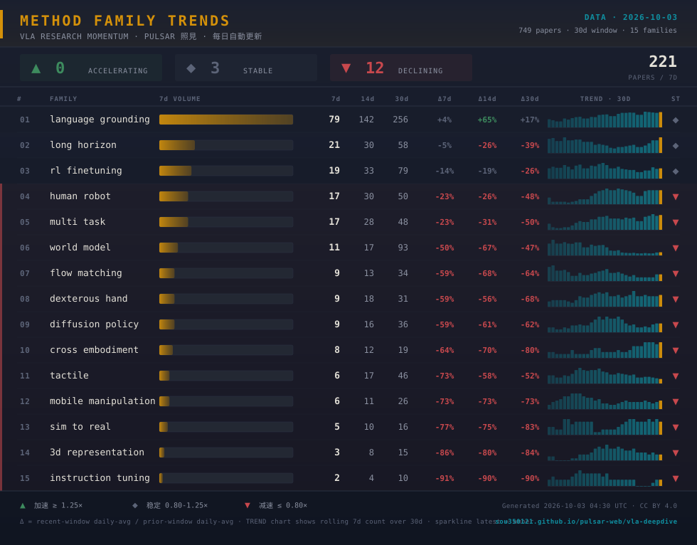

# Method Family Trends · VLA 方法族趋势

> 🖼️ **数据日期**: `2026-10-06` · **窗口**: 最近 `30` 天 · **累计论文**: `696` 篇 · **家族数**: `15`
>
> 每日自动生成 · 数据源 [pulsar-web vla-deepdive](https://sou350121.github.io/pulsar-web/vla-deepdive/)

---

## 📊 数据明细

| Family | 7d | 14d | 30d | Δ7d | Δ14d | Δ30d | Trend | Status |
|--------|:--:|:---:|:---:|:---:|:----:|:----:|:------|:------:|
| `language grounding` | 78 | 143 | 247 | 🔴 **-25%** | ·  +16% | 🟢 **+25%** | `▇▇▇▇▆▆█▇▇▇▇▆▆▇` | 🔴 ▼ |
| `long horizon` | 22 | 30 | 51 | ·  0% | ·  -16% | 🔴 **-28%** | `▃▃▄▄▃▃▄▅▆▆▇▇▇█` | · ◆ |
| `rl finetuning` | 20 | 32 | 70 | ·  -9% | 🔴 **-29%** | 🔴 **-36%** | `▇▆▆▆▅▅▆▆█▇▇▇▇▇` | · ◆ |
| `human robot` | 18 | 28 | 51 | ·  -18% | 🔴 **-21%** | 🔴 **-28%** | `█▇▇▆▄▄▇▇▇▇▇▇▇█` | · ◆ |
| `multi task` | 16 | 26 | 48 | 🔴 **-27%** | 🔴 **-27%** | 🔴 **-33%** | `▅▆▆▆▄▄▆▇█▇▇▆▆▇` | 🔴 ▼ |
| `diffusion policy` | 11 | 16 | 37 | 🔴 **-50%** | 🔴 **-55%** | 🔴 **-48%** | `█▅▄▅▃▃▄▃▅▅▅▅▅▆` | 🔴 ▼ |
| `world model` | 10 | 17 | 61 | 🔴 **-54%** | 🔴 **-67%** | 🔴 **-69%** | `▇▆▆▆▅▅▆▅▅▇█▆▆▇` | 🔴 ▼ |
| `tactile` | 8 | 16 | 46 | 🔴 **-63%** | 🔴 **-55%** | 🔴 **-35%** | `█▇▆▇▅▅▅▅▅▄▄▃▃▅` | 🔴 ▼ |
| `cross embodiment` | 7 | 13 | 18 | 🔴 **-68%** | 🔴 **-63%** | 🔴 **-75%** | `▃▃▄▆▆▆███▇█▆▆▇` | 🔴 ▼ |
| `dexterous hand` | 7 | 15 | 30 | 🔴 **-68%** | 🔴 **-58%** | 🔴 **-58%** | `▅▅▆█▅▅▆▅▅▅▆▄▄▅` | 🔴 ▼ |
| `mobile manipulation` | 7 | 12 | 24 | 🔴 **-68%** | 🔴 **-66%** | 🔴 **-66%** | `▆▇▆▆▆▆▇▆▅▆▇▇▇█` | 🔴 ▼ |
| `sim to real` | 6 | 11 | 18 | 🔴 **-73%** | 🔴 **-69%** | 🔴 **-75%** | `▅▆██▆▆▆█▆█▆▅▅█` | 🔴 ▼ |
| `flow matching` | 5 | 10 | 29 | 🔴 **-77%** | 🔴 **-72%** | 🔴 **-59%** | `█▆▅▆▄▄▄▄▄▇▇▄▄▄` | 🔴 ▼ |
| `instruction tuning` | 2 | 2 | 8 | 🔴 **-91%** | 🔴 **-94%** | 🔴 **-89%** | `████····▄█████` | 🔴 ▼ |
| `3d representation` | 2 | 6 | 15 | 🔴 **-91%** | 🔴 **-83%** | 🔴 **-79%** | `█▆▆█▅▅▅▄▅▄▄▃▃▃` | 🔴 ▼ |

---

## 📖 图例说明

- **7d / 14d / 30d**：该家族近 7 / 14 / 30 天内出现的论文篇数
- **Δ7d / Δ14d / Δ30d**：近窗口与前一窗口每日平均的比值（>1.25 加速 / <0.80 减速）
- **Trend**：过去 14 天每天的 7 日滚动计数 sparkline
- **Status**：🟢 ▲ 加速 · · ◆ 稳定 · 🔴 ▼ 减速

## 🔗 相关资源

- 🌐 [Pulsar 照見 · VLA 深挖实时看板](https://sou350121.github.io/pulsar-web/vla-deepdive/)
- 📡 [RSS 订阅](https://sou350121.github.io/pulsar-web/subscribe/)
- 📊 [VLA 数据工程指南](../theory/foundation/vla_data_engineering_guide.md)

> 本快照由 `scripts/export-method-family-viz.py` 每日自动生成 · 最后更新 `2026-10-06 04:30 UTC` · CC BY 4.0
